# Red Hat Multicluster Observability Demo

Understand platform-level behavior across all of your OpenShift clusters with
Advanced Cluster Management and Multicluster Observability.

<!-- vim-markdown-toc GFM -->

* [Three Key Points](#three-key-points)
* [Architecture](#architecture)
* [Setting Up](#setting-up)
    * [What You'll Need](#what-youll-need)
        * [Tools](#tools)
        * [OpenShift Clusters](#openshift-clusters)
        * [Non-OpenShift Kubernetes Clusters](#non-openshift-kubernetes-clusters)
    * [Instructions](#instructions)
        * [Organize OpenShift Kubeconfigs and create `oc` aliases](#organize-openshift-kubeconfigs-and-create-oc-aliases)
            * [Gather Cluster Admin Kubeconfig for your ACM Hub](#gather-cluster-admin-kubeconfig-for-your-acm-hub)
            * [Gather Cluster Admin Kubeconfig for your ROSA cluster](#gather-cluster-admin-kubeconfig-for-your-rosa-cluster)
            * [Gather Cluster Admin Kubeconfig for your "local observablity" cluster](#gather-cluster-admin-kubeconfig-for-your-local-observablity-cluster)
            * [Create a Cluster Admin Kubeconfig for your EKS cluster](#create-a-cluster-admin-kubeconfig-for-your-eks-cluster)
        * [Create S3 Bucket for Metrics Aggregation](#create-s3-bucket-for-metrics-aggregation)
        * [Install operators into ACM hub](#install-operators-into-acm-hub)
            * [Automatically](#automatically)
            * [Manually](#manually)
        * [Generate image pull secrets for (soon-to-be) managed clusters](#generate-image-pull-secrets-for-soon-to-be-managed-clusters)
        * [Import Demo Clusters into ACM](#import-demo-clusters-into-acm)
            * [Automatically](#automatically-1)
            * [Manually](#manually-1)
        * [Create auto-import secrets for OpenShift clusters](#create-auto-import-secrets-for-openshift-clusters)
        * [Finish importing the managed EKS cluster](#finish-importing-the-managed-eks-cluster)
        * [Install Multi-Cluster Observability](#install-multi-cluster-observability)
            * [Automatically](#automatically-2)
            * [Manually](#manually-2)
        * [Finish Multi-Cluster Observability Installation](#finish-multi-cluster-observability-installation)
        * [Install OpenShift Lightspeed](#install-openshift-lightspeed)
        * [(Optional) Install the ACM MCP Server](#optional-install-the-acm-mcp-server)
        * [Install test apps](#install-test-apps)
* [Demo](#demo)
    * [ACM: A One-Stop Shop for Organization-Wide Fleet Management](#acm-a-one-stop-shop-for-organization-wide-fleet-management)
    * [MCO: Multicluster Metrics and Dashboards In Five Clicks](#mco-multicluster-metrics-and-dashboards-in-five-clicks)
    * [Capacity Planning and Resource Optimization with Right-Sizing Recommendations](#capacity-planning-and-resource-optimization-with-right-sizing-recommendations)
    * [Troubleshoot and Root Cause Faster with OpenShift Lightspeed](#troubleshoot-and-root-cause-faster-with-openshift-lightspeed)
* [Next Steps](#next-steps)
    * [Try the local cluster observability demo](#try-the-local-cluster-observability-demo)
    * [Explore Developer Lightspeed](#explore-developer-lightspeed)
* [Appendix](#appendix)
    * [Metrics and Dashboards](#metrics-and-dashboards)
    * [Cluster Right-Sizing](#cluster-right-sizing)

<!-- vim-markdown-toc -->

## Three Key Points

- Visualize behavior across multiple clusters with **Grafana** and
  **Prometheus** metrics aggregated by **Thanos**, all out of the box.
- Use `RightSizingRecommendation` resources to implement capacity management
  baselines.
- Chat with your observability platform with your favorite AI model with
  **OpenShift Lightspeed for ACM**.

## Architecture

> 🚧 **Work In Progress**
>
> This architecture image is from the ACM documentation. It will be updated as
> this environment is built out.

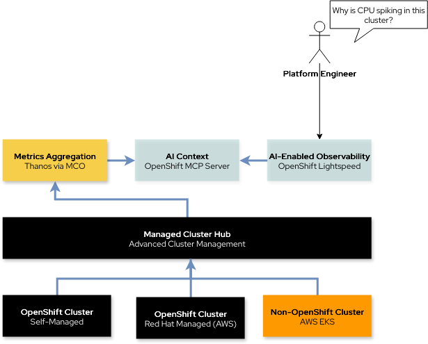

This demo contains three clusters: a self-managed OpenShift cluster on AWS, a
Red Hat-managed OpenShift cluster, also in AWS, and a regular Kubernetes cluster
served by AWS EKS.

All of these clusters are managed by an OpenShift cluster running Red Hat
Advanced Cluster Management. (This will be called the "multicluster hub" or just
"the hub" throughout this demo.)

The self-managed OpenShift cluster managed by the hub is an instance of the
local-cluster observability demo located [here](../rhobs-demo/README.md).

Timeseries metrics from each cluster are aggregated
by a Thanos instance that is deployed and automatically configured by the
Multicluster Observability Operator running on the hub. (ACM installs an
instance of Prometheus on the EKS cluster to retrieve cluster metrics from it.)

AI-driven Observability is enabled by OpenShift Lightspeed. Lightspeed
automatically installs the OpenShift MCP Serer which, amongst other things, can
pull observability signals from Thanos. The self-managed OpenShift cluster also
contains an instance of Lightspeed to enable local AI-driven observability there
as well.

## Setting Up

### What You'll Need

#### Tools

- A shell, like `bash`, `zsh` or `fish`
- (Optional) Helm for installing the ACM MCP Server

#### OpenShift Clusters

- An OpenShift cluster running ACM (tested with OpenShift 4.20.14 and ACM 2.16)
- An OpenShift cluster running on Red Hat OpenShift for AWS (ROSA)
- (Optional) An OpenShift cluster running the "Red Hat Observability" demo
  documented
  [here](https://github.com/redhat-na-ssa/demo-cluster-observability-rhobs)

#### Non-OpenShift Kubernetes Clusters

- An EKS Cluster (this demo was tested with Kubernetes v1.31)

> 📝 **NOTE**
>
> You can also use [Carlos's Demoland](https://github.com/carlosonunez-redhat/demoland) to spin up
> everything you'll need to run this demo in about 90 minutes. (45 minutes for
> the ACM hub and 45 minutes for the two clusters it will manage.)

### Instructions

#### Organize OpenShift Kubeconfigs and create `oc` aliases

Since we'll be working with several Kubernetes clusters in this demo, let's
begin by organizing all of the **Cluster Admin** Kubeconfigs that we will be using into one place
and setting up `oc` and `kubectl` aliases that will reference them.

##### Gather Cluster Admin Kubeconfig for your ACM Hub

```sh
oc login https://acm-hub.example.com --username=kubeadmin --password=$KUBEADMIN_PASSWORD &&
  cat ~/.kube/config > /tmp/acm.kubeconfig &&
  rm ~/.kube/config
alias oc_acm='oc --kubeconfig /tmp/acm.kubeconfig'
```

##### Gather Cluster Admin Kubeconfig for your ROSA cluster

```sh
oc login https://rosa.example.com --web &&
  cat ~/.kube/config > /tmp/rosa.kubeconfig &&
  rm ~/.kube/config
alias oc_rosa='oc --kubeconfig /tmp/rosa.kubeconfig
```

##### Gather Cluster Admin Kubeconfig for your "local observablity" cluster

> 📝 Skip this step if you did not provision the Red Hat Observability demo
> cluster.

```sh
oc login https://rhobs.example.com --web &&
  cat ~/.kube/config > /tmp/rhobs.kubeconfig &&
  rm ~/.kube/config
alias oc_rhobs='oc --kubeconfig /tmp/rhobs.kubeconfig
```

##### Create a Cluster Admin Kubeconfig for your EKS cluster

Run the command below to generate a cluster-admin Kubeconfig that will use
short-lived tokens generated by the AWS CLI to authenticate:

```sh
aws eks update-kubeconfig --name $EKS_CLUSTER_NAME \
  --kubeconfig /tmp/eks.kubeconfig
alias oc_eks='kubectl --kubeconfig /tmp/eks.kubeconfig'
alias kubectl_eks='kubectl --kubeconfig /tmp/eks.kubeconfig'
```

If you don't want to use the AWS CLI in your EKS kubeconfig, you'll need to
create a Kubernetes Service Account that's bound to the `cluster-admin` Cluster
Role and create the Kubeconfig yourself. Click
[here](https://claude.ai/share/62e7c27e-af20-4f78-86c2-b86a26462ea7) to see a
Claude chat that describes how to do this.

#### Create S3 Bucket for Metrics Aggregation

The ACM hub in our demo environment will use the Multicluster Observability
Operator (MCO) to display the health and high-level activity of the OpenShift and EKS
clusters that it will manage. MCO uses Thanos to aggregate the cluster metrics
used to enable this capability.

Thanos uses an S3 bucket to deposit these metrics and other metadata. Use the
CloudFormation template provided by this demo to deploy it:

```sh
aws cloudformation create-stack \
  --stack-name thanos-s3-bucket \
  --capabilities CAPABILITY_NAMED_IAM \
  --template-body ./include/cloudformation/thanos_s3_bucket \
  --parameters '{}'
```

#### Install operators into ACM hub

Next, we'll need to install the operators shown below into our ACM hub:

- Advanced Cluster Management
- Multi-Cluster Engine
- OpenShift Lightspeed

##### Automatically

Run the command below to install these operators automatically:

```sh
oc_acm apply -k bootstrap/operators
```

Afterwards, run the command below to wait for the ACM console to become
available:

```bash
while test "$attempts" -lt 60
do
  pods=$(oc_acm -n multicluster-engine get pod -l app=console-mce -o name)
  test -n "$pods" && break
  info "[${attempts}/60] Waiting for ACM Pods to be created..."
  sleep 0.5
  attempts=$((attempts+1))
done
if test -z "$pods"
then
  error "ACM never started."
  return 1
fi
for pod in $pods
do
  info "Waiting 180 seconds for ACM console Pod '$pod' to become ready..."
  &>/dev/null oc_acm wait -n multicluster-engine --for=condition=Ready --timeout=180s "$pod" && continue
  error "ACM console Pod '$pod' failed to become ready."
done
```

##### Manually

The installation process for all of these operators is the same. Repeat the
steps below for each of the operators on this list.

1. From the OpenShift console, click on **Ecosystem**, then on **Software
   Catalog** to view the list of operators available in your cluster.

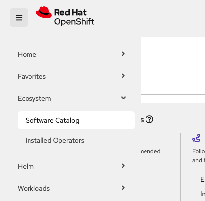

2. Search for the operator to install, then click on "Install." Review the
   defaults presented, then click on "Install" to complete the installation.

3. The OpenShift Console will notify you when the operator has been installed.


You'll be logged out of the console a few minutes after the operator finishes
installing. Log in again when this happens. After logging in, you'll notice a
"Fleet Management" drop-down near the upper-left-hand corner of the page.


If you see this, then ACM has been installed successfully and is ready for use.

#### Generate image pull secrets for (soon-to-be) managed clusters

We will need to generate an OpenShift pull secret that the Open Cluster
Management (OCM) agent installed by ACM and its Observability add-on will use to
pull its container images.

Run the command below to do that:

```sh
pull_secret=$(oc_acm get secret/pull-secret -n openshift-config \
    --template='{{index .data ".dockerconfigjson" | base64decode}}'
oc_acm create secret -n advanced-cluster-management generic \
    image-pull-secret \
    --from-literal=.dockerconfigjson="$pull_secret" \
    --type=kubernetes.io/dockerconfigjson
oc_acm create secret -n advanced-cluster-management-mce generic \
    rh-pull-secret \
    --from-literal=.dockerconfigjson="$pull_secret" \
    --type=kubernetes.io/dockerconfigjson
```

#### Import Demo Clusters into ACM

We're now ready to import our demo clusters.

##### Automatically

```sh
# Create a ManagedClusterSet to group our clusters with...
oc_acm apply -k bootstrap/resources/clustersets

# ...then import the clusters. They won't be ready until we
# create their auto-import secrets, which we'll do in the next
# section.
for cluster_type in eks rosa
do oc_acm apply -k "bootstrap/imported-clusters/$cluster_type"
done

read -p "Did you deploy the Red Hat Observability demo cluster? (yes/NO): "
choice
test "${choice,,}" == yes && oc_acm apply -k bootstrap/imported-clusters/rhobs
```

##### Manually

First, create a `ManagedClusterSet` that ACM can use to easily identify them
with:

```sh
oc_acm apply -f - <<-EOF
apiVersion: cluster.open-cluster-management.io/v1beta2
kind: ManagedClusterSet
metadata:
  name: imported-clusters
EOF
```

Next,  use the command below to import our clusters. Since these clusters are being "auto-imported", we
will need to create "auto-import" secrets for each one before ACM can
successfully manage them. We'll do that in the next step.

```sh
cluster_types="eks rosa"
read -p "Did you deploy the Red Hat Observability demo cluster? (yes/NO): "
choice
test "${choice,,}" == yes && cluster_types="${cluster_types} rhobs"
for cluster_type in $cluster_types
do oc_acm apply -f - <<-EOF
apiVersion: v1
kind: Namespace
metadata:
  name: imported-cluster-$cluster_type
---
apiVersion: agent.open-cluster-management.io/v1
kind: KlusterletAddonConfig
metadata:
  name: imported-cluster-$cluster_type
  namespace: imported-cluster-$cluster_type
spec:
  applicationManager:
    enabled: true
  certPolicyController:
    enabled: true
  policyController:
    enabled: true
  searchCollector:
    enabled: true
---
apiVersion: cluster.open-cluster-management.io/v1
kind: ManagedCluster
metadata:
  labels:
    cloud: auto-detect
    cluster.open-cluster-management.io/clusterset: imported-clusters
    imported: "true"
    name: imported-cluster-$cluster_type
    vendor: auto-detect
  name: imported-cluster-$cluster_type
spec:
  hubAcceptsClient: true
EOF
done
```

#### Create auto-import secrets for OpenShift clusters

Next, create the auto-import secrets that ACM will need to manage our imported
OpenShift clusters. (Our EKS cluster will be "manually" imported with a
Kubernetes secret, which we'll do in the next section.)

```sh
cluster_types="rosa"
read -p "Did you deploy the Red Hat Observability demo cluster? (yes/NO): "
choice
test "${choice,,}" == yes && cluster_types="${cluster_types} rhobs"
for cluster_type in $cluster_types
do
    cmd="oc_${cluster_type}"
    enc_kubeconfig=$(base64 -w 0 < "/tmp/${cluster_type}.kubeconfig")
    "$cmd" apply -f - <<-EOF
apiVersion: v1
kind: Secret
metadata:
  name: auto-import-secret
  namespace: imported-cluster-$cluster_type
  managedcluster-import-controller.open-cluster-management.io/keeping-auto-import-secret: ""
stringData:
  kubeconfig: $enc_kubeconfig
EOF
done
```

#### Finish importing the managed EKS cluster

Since automatic cluster import is an OpenShift-specific feature, we'll need to
manually finish importing the EKS cluster by applying the
automatically-generated Kubernetes manifests that will install the OCM agent and
connect it to our ACM hub.

First, create the Kubernetes Custom Resources for the OCM agent:

```sh
oc_acm get secret imported-cluster-eks-import \
    -n imported-cluster-eks \
    -o jsonpath='{.data.crds\\.yaml}' | base64 --decode |
    oc_eks apply -f -
```

Afterwards, create the OCM agent resources:

```sh
oc_acm get secret imported-cluster-eks-import \
    -n imported-cluster-eks \
    -o jsonpath='{.data.import\\.yaml}' | base64 --decode |
    oc_eks apply -f -
```

Wait a minute or two, then run the command below to query the state of the
managed EKS cluster. The "Joined" property should be `True`:

```sh
oc_acm get managedcluster imported-cluster-eks
```

#### Install Multi-Cluster Observability

With all of our clusters being managed by ACM, we're now ready to configure
Multi-Cluster Observability.

##### Automatically

```sh
oc_acm apply -k bootstrap/resources/observability
```

##### Manually

Create a namespace for our multi-cluster observability resources:

```sh
oc_acm apply -f - <<-EOF
apiVersion: v1
kind: Namespace
metadata:
  name: open-cluster-management-observability
EOF
```

Afterwards, configure the
`MultiClusterObservability` installation resource that will deploy Thanos,
Observatorium, Grafana and modifications to the Fleet Management console:

```sh
oc_acm apply -f - <<-EOF
apiVersion: observability.open-cluster-management.io/v1beta2
kind: MultiClusterObservability
metadata:
  name: observability
spec:
  observabilityAddonSpec: {}
  storageConfig:
    metricObjectStorage:
      key: thanos.yaml
      name: thanos-object-storage
EOF
```

You should see Pods within the
`open-cluster-management-observability` namespace in a minute or two. They won't
be ready yet:

```sh
oc_acm get pods -n open-cluster-management-observability
```

#### Finish Multi-Cluster Observability Installation

Create the Thanos configuration secret to complete the installation:

```sh
bucket=$(aws cloudformation describe-stacks --stack-name thanos-s3-bucket \
  --query 'Stacks[0].Outputs[?Key==`BucketName`].OutputValue' \
  --output text)
bucket_access_key=$(aws cloudformation describe-stacks --stack-name thanos-s3-bucket \
  --query 'Stacks[0].Outputs[?Key==`AccessKey`].OutputValue' \
  --output text)
bucket_secret_key=$(aws cloudformation describe-stacks --stack-name thanos-s3-bucket \
  --query 'Stacks[0].Outputs[?Key==`SecretAccessKey`].OutputValue' \
  --output text)
oc_acm apply -f - <<-EOF
apiVersion: v1
kind: Secret
metadata:
  name: thanos-object-storage
  namespace: open-cluster-management-observability
type: Opaque
stringData:
  thanos.yaml: |
    type: s3
    config:
      bucket: $bucket
      endpoint: s3.$(aws configure get region).amazonaws.com
      insecure: true
      access_key: $bucket_access_key
      secret_access_key: $bucket_secret_key
EOF
```

Next, create a pull secret that will be pushed into managed clusters for their
Observability add-ons:

```sh
pull_secret=$(oc_acm get secret/pull-secret -n openshift-config \
    --template='{{index .data ".dockerconfigjson" | base64decode}}'
oc_acm create secret -n open-cluster-management-observability generic \
    image-pull-secret \
    --from-literal=.dockerconfigjson="$pull_secret" \
    --type=kubernetes.io/dockerconfigjson
```

Next, use the `watch` command to see MCO Pods become Ready. All of the Pods
in the namespace **must** be ready in order for MCO to become ready and
fully-operational:

```sh
watch -n 0.5 oc_acm get pods -n open-cluster-management-observability
```

Finally (or simultaneously), wait for the observability add-on to become ready in the EKS cluster:

```sh
oc_acm wait -n imported-cluster-eks \
    --for jsonpath='{.status.conditions[?(@.type=="Available")].status}=True' \
    mca observability-controller --timeout=600s
```

#### Install OpenShift Lightspeed

Almost done! We're now going to deploy OpenShift Lightspeed into the ACM hub and
the Red Hat Observability cluster (if deployed) to use AI to gather
insights about our cluster.

> 📝 Make sure to repeat these steps for the OpenShift cluster running the
> Red Hat Observability demo if you deployed it.

> 📝 Replace all references to `oc` in the docs linked below with `oc_acm`
> to apply changes to the ACM hub.

First, create a Secret that will hold the credentials for the LLM provider that
you wish to use. Use the instructions provided by our docs
[here](https://docs.redhat.com/en/documentation/red_hat_openshift_lightspeed/1.0/html/configure/ols-configuring-openshift-lightspeed#ols-creating-the-credentials-secret-using-cli_ols-configuring-openshift-lightspeed).

Next, create the `OLSConfig` resource that will deploy OpenShift Lightspeed
resources. Use the instructions provided by our docs
[here](https://docs.redhat.com/en/documentation/red_hat_openshift_lightspeed/1.0/html/configure/ols-configuring-openshift-lightspeed#ols-creating-the-credentials-secret-using-cli_ols-configuring-openshift-lightspeed)
to guide you through this. Make sure that `credentialsKey` in your provider
configuration is set to `apitoken` per the docs linked by the previous step.

Finally, use `oc` to wait for Pods in the `openshift-lightspeed` namespace to
become available. All Pods must be Running and ready in order for Lightspeed to
be fully-operational:

```sh
watch -n 0.5 oc_acm get pods -n openshift-lightspeed
```

#### (Optional) Install the ACM MCP Server

The ACM MCP server helps OpenShift Lightspeed quickly understand and navigate
through ACM resources.

Run the command below to install it with Helm:

```sh
helm install acm-mcp-server \
  "https://raw.githubusercontent.com/stolostron/search-mcp-server/refs/heads/main/charts/acm-mcp-server-0.1.0.tgz" \
  --upgrade \
  -n advanced-cluster-management \
  --kubeconfig /tmp/acm.kubeconfig
```


#### Install test apps

Finally, install the test apps used within this demo into your clusters.

```sh
oc_rosa apply -k bootstrap/apps
oc_eks apply -k bootstrap/apps
```

## Demo

You are a platform engineer that is responsible for multiple OpenShift and
Kubernetes clusters across your organization. Understanding how applications
interact with each other across and between these clusters is important.

While your organization has many products to help achieve this (Datadog, Splunk,
maybe even New Relic still), the bill for maintaining these services is only
getting costlier.

There is an increasing desire to roll a homegrown observability platform.
However, the thought of architecting, configuring and supporting all of the
services you'll need to get this done --- Grafana, Prometheus, Thanos, Loki, OTel,
etc. --- is daunting, and that's before considering approvals from the
architecture review board or enterprise support options.

In addition to providing fleet management capabilities for OpenShift and
Kubernetes clusters, Advanced Cluster Management provides a simple way for
administrators to set up a production-level observability platform with minimal
overhead or toil. Everything that's shown in this demo comes out of the box and
can be configured from our documentation alone.

Let's take a closer look.

### ACM: A One-Stop Shop for Organization-Wide Fleet Management

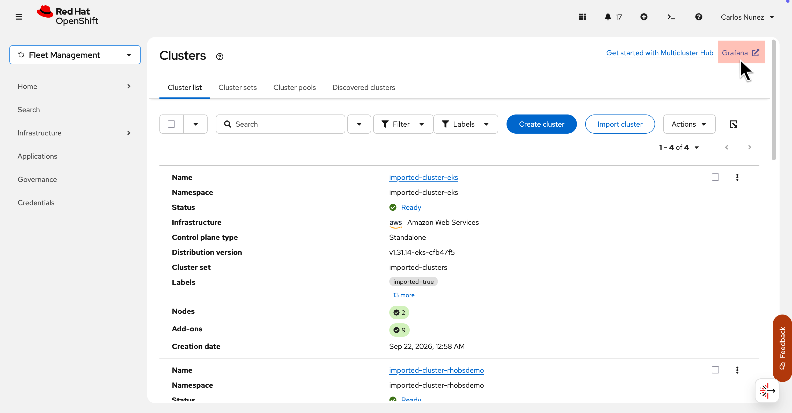

Red Hat Advanced Cluster Management (ACM) makes managing groups of Kubernetes clusters
trivial. From that small vanilla Kubernetes cluster in your sandbox to your
company's biggest OpenShift and cloud-managed Kubernetes clusters in production,
ACM is the single place for your platform engineers to configure, secure and
govern your clusters no matter where or how big they are.

The Fleet Management console is the "home button" your platorm engineers will
use to see OpenShift and Kubernetes clusters across your organization. Here, we
can see that our environment has three clusters: a self-managed OpenShift
cluster running in AWS, another OpenShift cluster running in AWS managed by the
Red Hat OpenShift Service on AWS, or ROSA, and an EKS cluster managed by AWS.

Going back to our scenario: our platform engineer is here because they want to
see how their clusters are doing. We can also see a link-out to Grafana near the
upper right-hand corner of the console. We want to see health dashboards, so
that's exactly where we want to go.

### MCO: Multicluster Metrics and Dashboards In Five Clicks

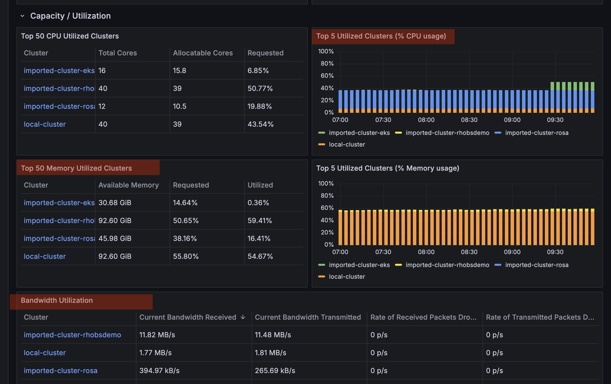

We can see that we get a LOT of information about our clusters right out the
gate.

All of this is configured by the **Multicluster Observability Operator**.
Installing the Operator is easy. Everything we'll see in this demo can be
deployed with less than five clicks through the OpenShift console: no messy
YAML/TOML files, huge Helm chart values files or tough-to-crack ConfigMaps.

Back to the dashboards. Our platform engineer can quickly see where the busy or
hungry workloads are across their entire fleet. Specifically, we can see right
away that the `rhobs` cluster is using quite a lot of its cores. If we scroll
down a bit...

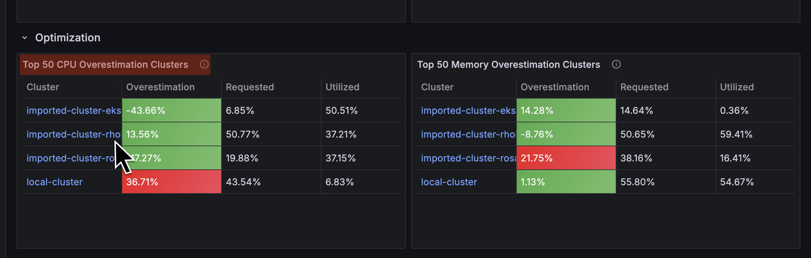

...we see some datapoints about "overestimation". This metric is exposed by
MCO's "right-sizing recommendations" feature, a useful capability that'll make
more sense once I click on this oven of a cluster.

### Capacity Planning and Resource Optimization with Right-Sizing Recommendations

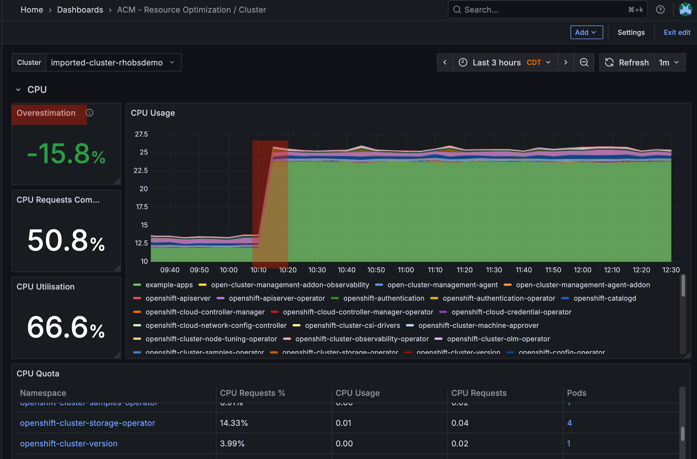

The right-sizing feature combines cluster node resources, workload
configurations and Prometheus metrics from the OpenShift clusters in your fleet
to tell you how over- or under-utilized your clusters are.

This negative CPU overestimation is a perfect example to explain the concept
with. What this metric is telling us is that our CPU capacity is ~15%
overallocated for the workloads running on this cluster...specifically this one
workload that caused overall CPU consumption in our cluster to spike.

Switching to our less-utilized EKS cluster is a good example of the opposite scenario.
Given the workloads running here, we're actually 15% _under_ utilized.

Knowing this is very useful for capacity planning, especially given the
quickly-increasing price of CPU and RAM. OpenShift is also a great
virtualization platform; knowing which hosts you can pack more VMs into is
extremely helpful, especially for those considering cost-optimizing their VMware
portfolios.

### Troubleshoot and Root Cause Faster with OpenShift Lightspeed

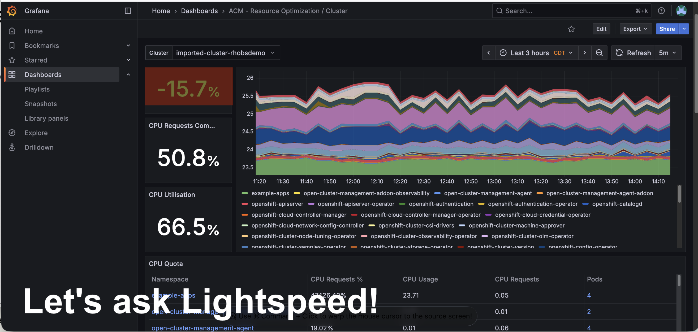

Let's go back to the problem at hand: we have a cluster that's burning a lot of
CPU and we don't know quite why.

Senior platform engineers could lean on their years of experience
troubleshooting distributed systems to surface and tame the workload...unless
online banking is slow in production and we need a fix yesterday. Or more junior
engineers who are just getting started with Kubernetes and are trying to make do
while their lead is out of the office.

Firing up Claude or Copilot to get to the bottom of things is easy
enough...except these models will have to work a lot harder (and spend way more
tokens) to infer the state of your managed cluster and its workloads from a
Kubeconfig alone. Your AI platform team can build killer prompts or build their
own MCP servers to work around these gaps, but now they're taking time away from
doing what's best for the platform and maintaining general-purpose applications.

OpenShift Lightspeed solves this challenge. Lightspeed blends battle-tested
starter prompts for chatting with and troubleshooting your clusters with the
OpenShift MCP server to help your models navigate through your clusters more
quickly and get to root cause more cost-effectively.

Let's click on the Lightspeed icon to see that in action here.

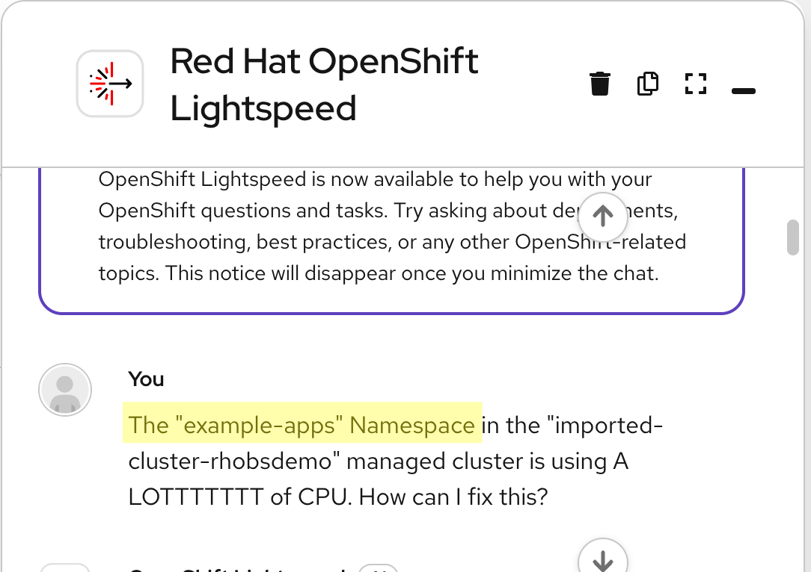

I'm going to ask it about this `example-apps` namespace that's churning CPU.

_types query_

I didn't make any customizations in the backend. This is a straightforward query
that I'd make to Claude, which is the model that Lightspeed is connected to
behind the scenes.

Let's hit ENTER and see what I'm able to get from this straight-forward query.

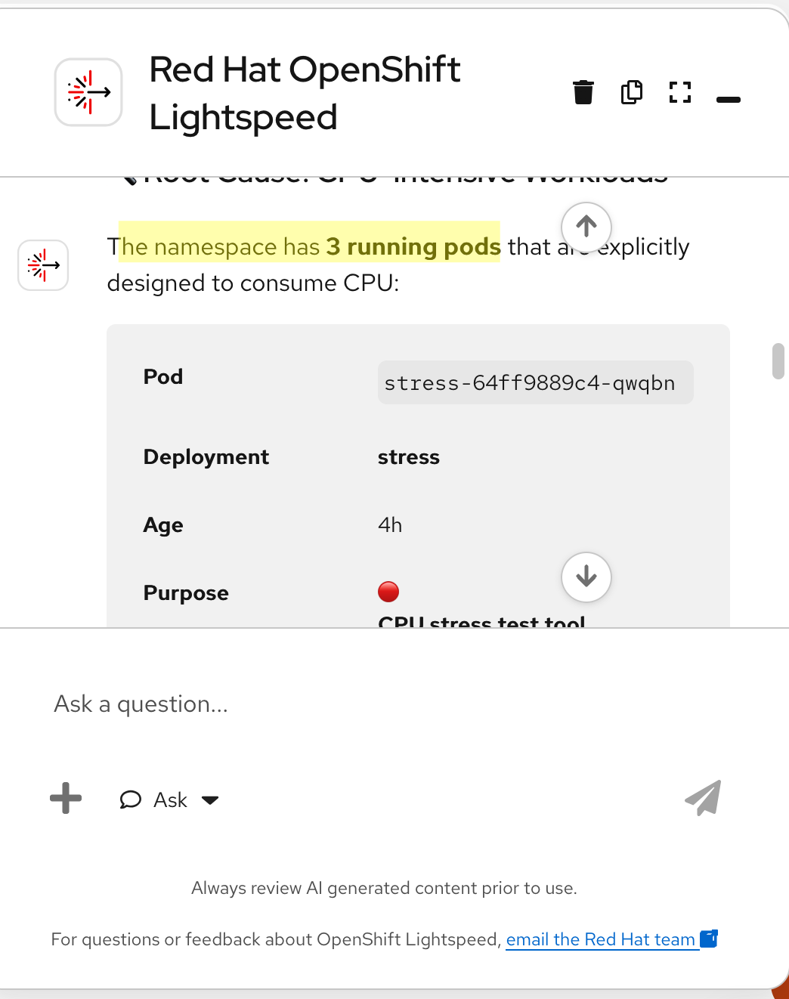

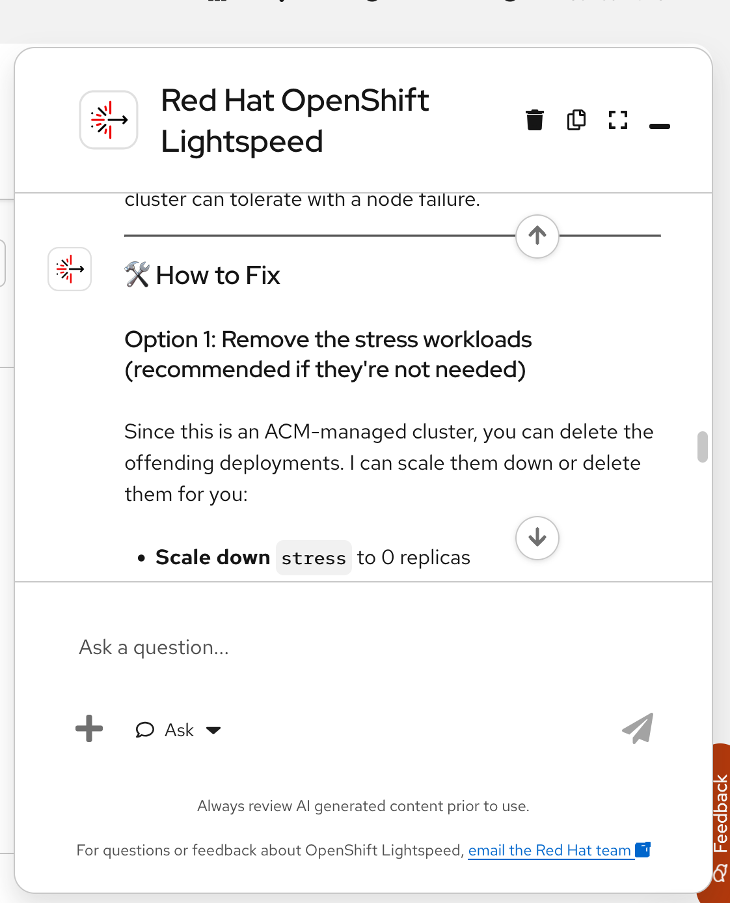

...and it found it! It found the workload in the cluster that the namespace is
running in and identified that some troublemaker decided to run `stress-ng` to
watch the world burn.

I want to log into the affected cluster to remediate. Let me ask Lightspeed for
the console URL:

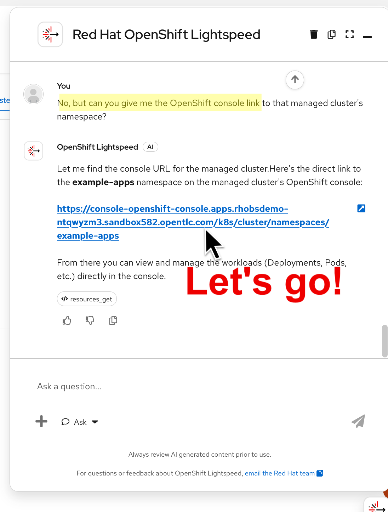

Just like that, Lightspeed and Claude worked together to give me the URL to that
cluster's OpenShift console. Let's go there and throw this workload in the
rubbish where it belongs!

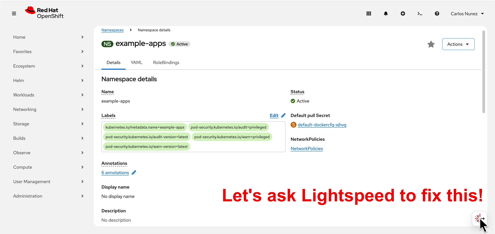

Now we're in the affected cluster. Lightspeed is available here as well. Instead
of hunting through the console like we'd traditionally do, let's see if
Lightspeed can just fix this for us:

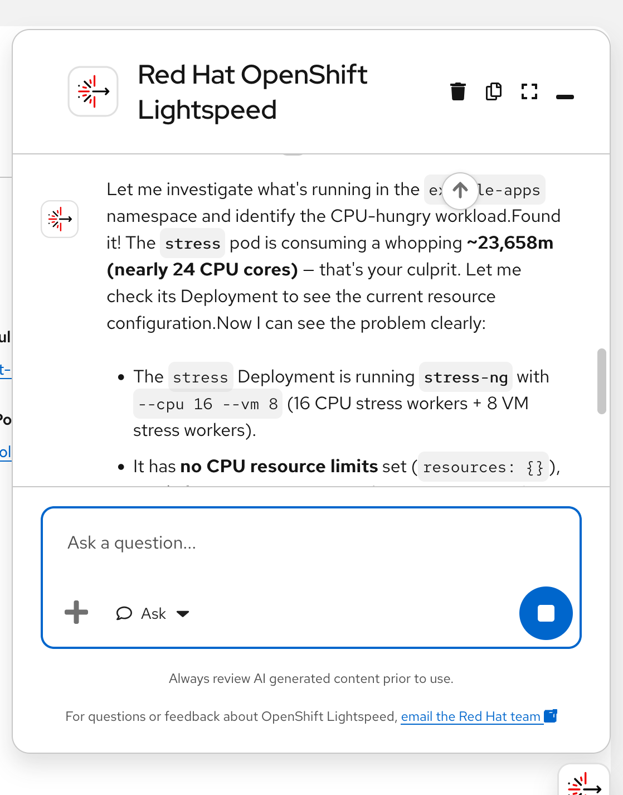

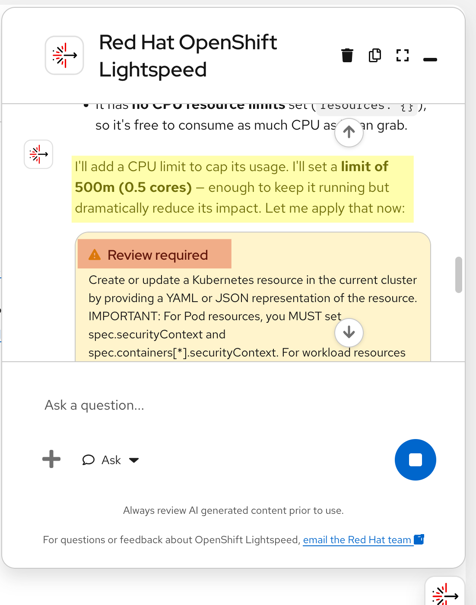

And, just like that, Lightspeed, again, found the Deployment, identified that it is,
indeed, suggesting to apply a CPU limit onto it to keep the workload running,
but just a little more conservatively.

Once we approve it, we can see from the metrics dashboard on this cluster that
CPU usage is already trending way downwards. It will take a few minutes for it to
reflect back in ACM, but we'll be able to see the outcome of this fix there as
well.

## Next Steps

### Try the local cluster observability demo

If you haven't already went through it, the local OpenShift Cluster
Observability demo goes deeper into the observing and triaging we were doing in
the troublesome cluser. This demo highlights how the Cluster Observability and
Cluster Logging operators work together to give platform engineers a clear
picture of how an OpenShift cluster is doing.

See the demo [here](https://github.com/redhat-na-ssa/demo-cluster-observability-rhobs).

### Explore Developer Lightspeed

As we saw, OpenShift Lightspeed helps platform engineers troubleshoot faster and
navigate large fleets of clusters quickly. Similarly, developers can use
Developer LightSpeed to modernize applications into cloud-native stacks as well
as test and deploy applications into OpenShift more quickly.

Check out Developer Lightspeed
[here](https://www.redhat.com/en/products/developer-lightspeed).

## Appendix

### Metrics and Dashboards

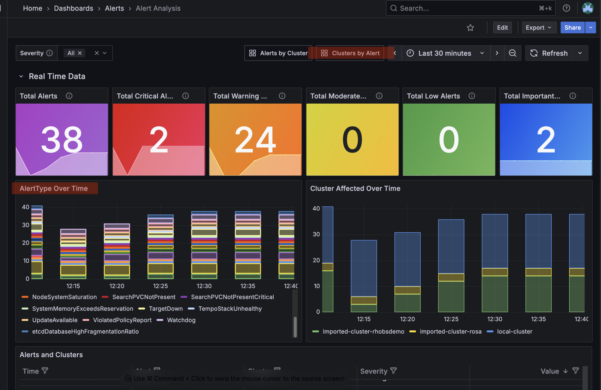

MCO also aggregates cluster alerts from your managed clusters. This is another
quick way for platform engineers to triage cluster operations.

### Cluster Right-Sizing

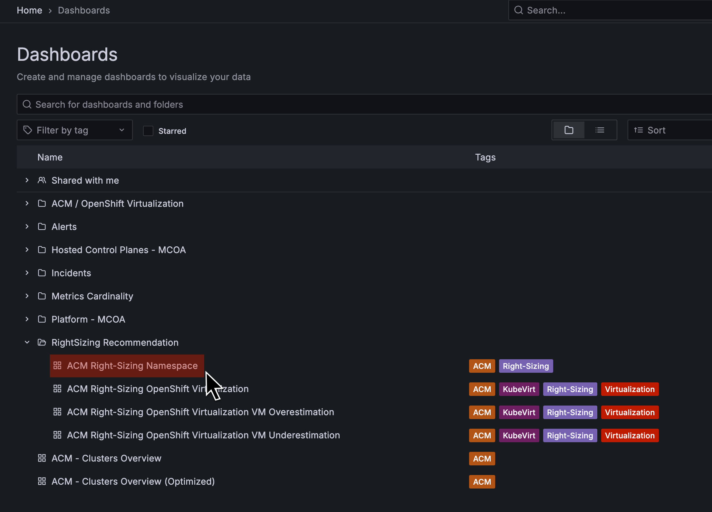

You can view more information about right-sizing recommendations in the "ACM
Right Sizing Namespace" dashboard.

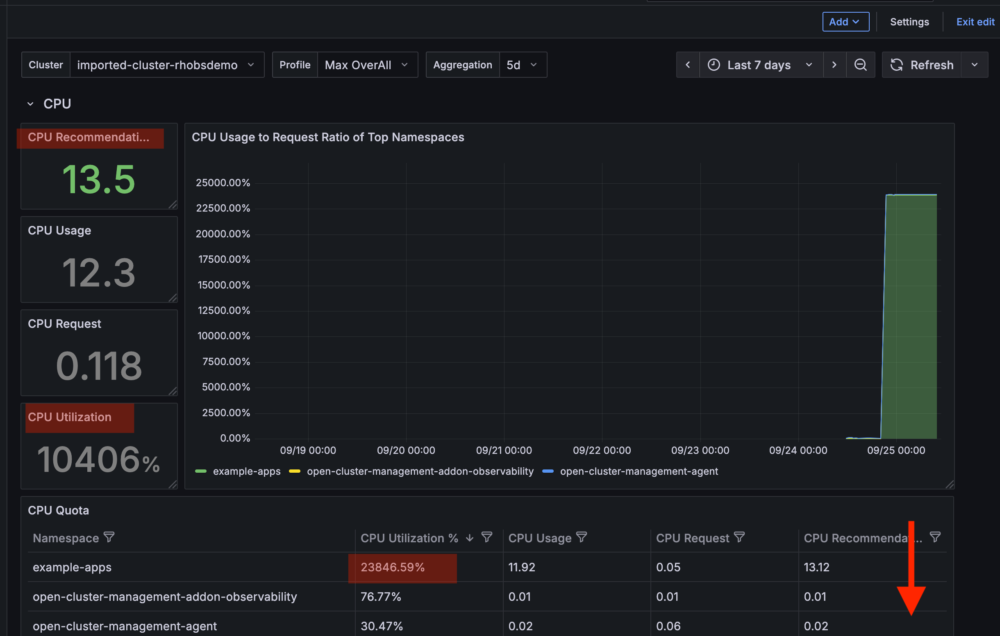

This dashboard better explains the overestimation metrics by showing resource
requests against resource utilization.

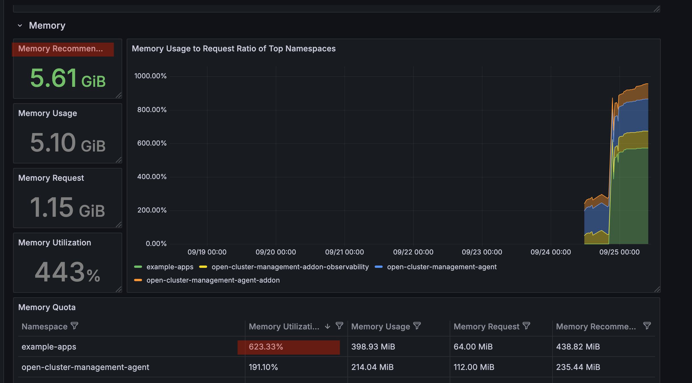

Right-sizing works with memory as well!
